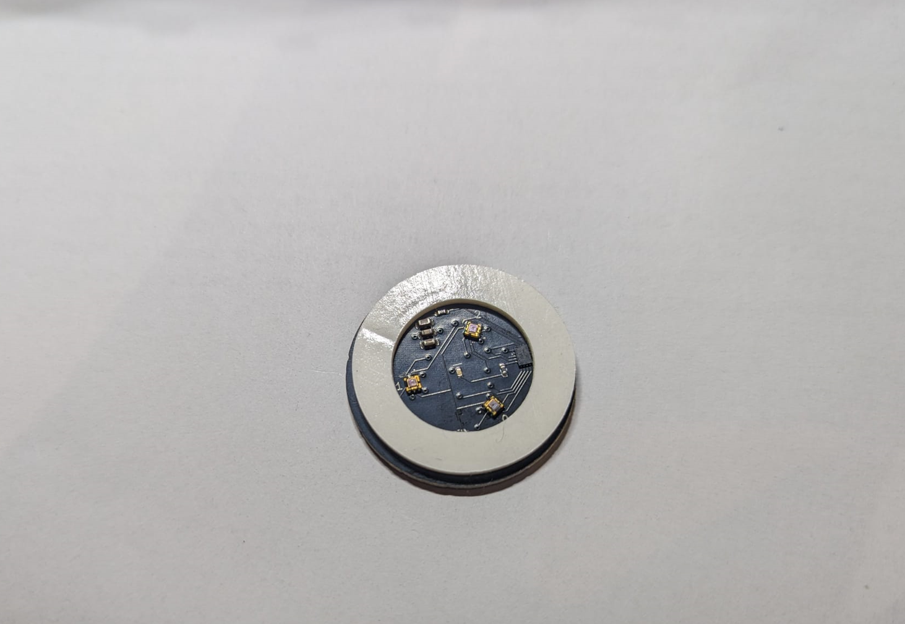
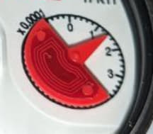
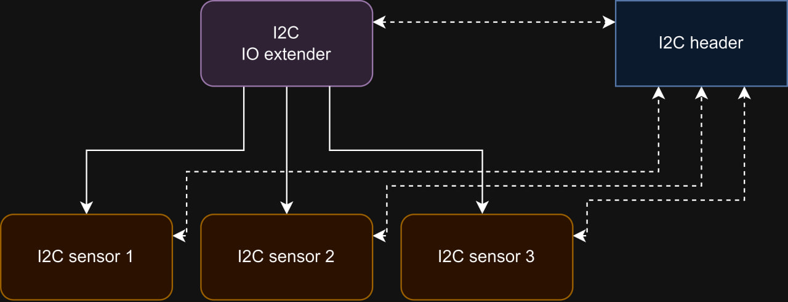
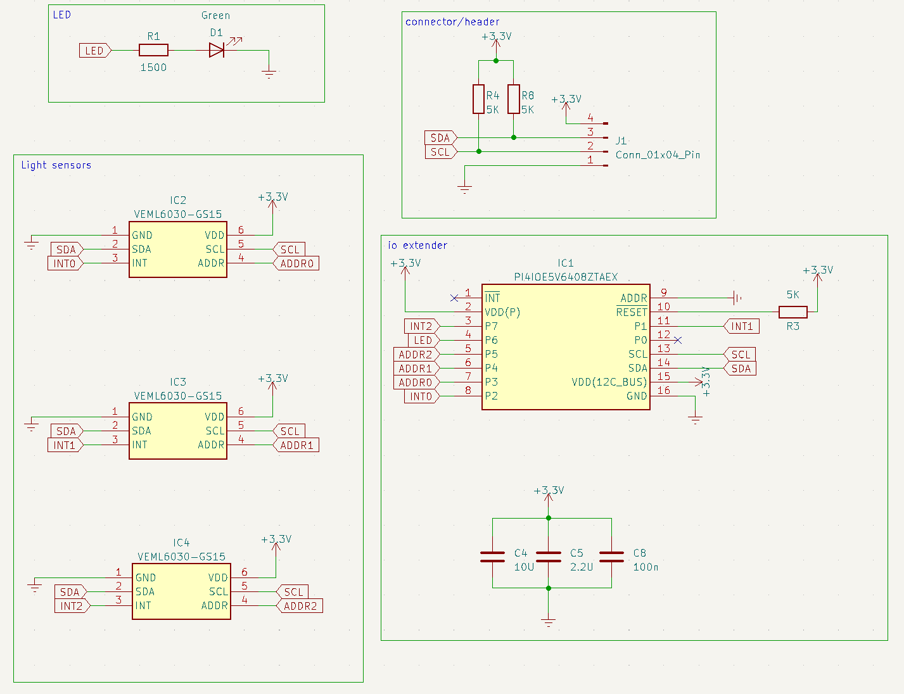

# 3-phase-muino-sensor
Introducing the 3-Phase Muino Sensor, an encoder-like sensor that redefines the way we capture and utilize analog data. This cutting-edge technology harnesses the power of three phases to provide highly accurate measurements, enabling you to tackle a wide range of applications. Whether you need precise positioning data, advanced control algorithms, or efficient energy monitoring, the 3-Phase Muino Sensor is your gateway to enhanced performance and innovation. Explore its capabilities and discover the future of analog sensor solutions.

https://www.tindie.com/products/muino/3-phase-muino-light-sensor-encoder/

## Sensor usecases
In today's world, many analog sensors rely on rotating disks, like the one illustrated below, to convert physical movements into measurable data. By digitizing the analog output of these sensors, you can precisely monitor and track various positions. Imagine applying this technology to create a water meter algorithm, ensuring efficient and accurate measurements.

Take a look at this illustrative figure of a disk that demonstrates the possibilities:

Unlock the potential of analog sensor data with our innovative solutions. 
## Diagram

The following diagaram is explained in the following bullet points

- The I2C Header: The header connects your device to the sensor board using four pins: 3.3V (power), GND (ground), SDA (Serial Data Line), and SCL (Serial Clock Line). These connections enable communication and power supply between your device and the sensor board.

- Multiple Lightsensors (VEML6030-GS15): The sensor board contains multiple light sensors, and each of them has its own built-in ADC (Analog-to-Digital Converter). These light sensors are connected to the I2C header, allowing your device to read data from them via the I2C communication protocol.

- IO Extender: To address a potential limitation of the I2C communication protocol, an IO extender is used. I2C devices typically have a limited number of addresses they can respond to. In this case, the sensors on the board have only two available addresses they can listen to. To ensure that you can address each sensor correctly, the IO extender is employed. It allows you to set an address input for each sensor as high or low.

  - For example, if you set the address of one sensor high and the addresses of the other two sensors low, you can effectively assign addresses to these sensors. In this setup, one sensor may have an address of 0x00, and the other two sensors will have an address of 0x01. This is a workaround to distinguish and communicate with individual sensors.

- Addressing Consideration: It's important to note that because of this addressing scheme, when you request data from a sensor with address 0x01, only the sensor with that specific address will respond. The other two sensors, with addresses set to 0x00, will not respond to the request. This is essential for ensuring that you can interact with each sensor independently, even though they share the same I2C bus.

## Circuit

The circuit is divided into four parts:

### Light Sensors

The light sensors used in the circuit are VEML6030-GS15. These sensors are essentially light sensors with a built-in circuit designed to measure light intensity in a stable and less noisy manner. They provide better performance than using ADC versions due to the compensations they offer.

### IO Extender

An IO extender is used in the circuit to enable the LED and ensure that the correct light sensor is communicated with. The interrupt pins of the light sensors are connected to create a low-power setup that initiates reading when the sensor value reaches a certain threshold. This setup allows the system to wake up for readings when necessary. [PI4IOE5V6408](https://www.diodes.com/assets/Datasheets/PI4IOE5V6408.pdf)

### Connector Header

The connector header on the circuit board includes pull-up resistors and the necessary pins for communication with your device. This header simplifies the connection between your device and the circuit.

### LED

The LED chosen for the circuit is optimized for low power consumption, using a maximum of only 1mA. This level of power efficiency is remarkable for LEDs and is particularly suitable for battery-powered applications. The LED is designed to minimize power consumption while providing enough excitement for the light sensors, even in dark environments.

